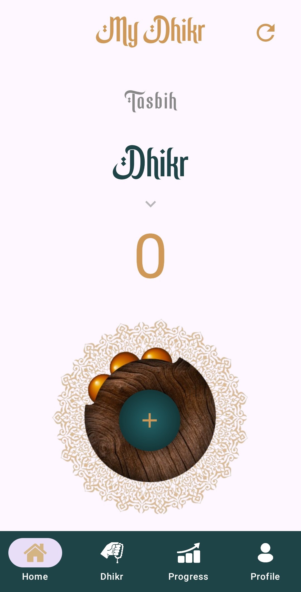
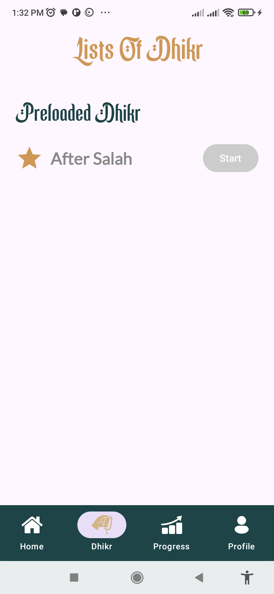

# 🌙 Noor Tasbih – Digital Dhikr Counter App

A beautiful, minimal, and spiritually soothing **Tasbih app** designed to help Muslims keep track of their daily dhikr. Noor Tasbih lets you perform dhikr with a digital counter, track your progress, and view your most repeated adhkar with ease.

---

## 📸 Screenshots

| Home Screen | Dhikr Screen | Progress Screen | Login Screen |
|--------------|--------------|-----------------|-----------------|
|  |  |  | |

---

## ✨ Features

- 📿 **Digital Tasbih Counter** – Count your dhikr with a smooth, responsive counter interface.  
- 🌙 **Preloaded Adhkar** – Includes the most common dhikr after Salah:  
  - *Subhanallah*  
  - *Alhamdulillah*  
  - *Allahu Akbar*  
  - *La ilaha illallah*  
  - *Astaghfirullah*  
- 📈 **Progress Tracking** – View your total counts, targets (e.g., 500), and your most repeated dhikr.  
- 🕌 **Beautiful Islamic UI** – Inspired by calm colors and elegant Arabic typography.  
- 💾 **Persistent Data** – Keeps your dhikr progress safe even after closing the app.  
- 🔄 **Easy Navigation** – Simple bottom navigation with tabs: Home, Dhikr, Progress, and Profile.  

---

## 🛠️ Tech Stack

| Technology | Purpose |
|-------------|----------|
| **Kotlin** | Core programming language |
| **Jetpack Compose** | Modern Android UI toolkit |
| **Android Studio** | Development environment |
| **Material Design 3** | For clean, modern components |

---

## 🚀 How It Works

1. Open the **Home tab** to start your tasbih counter.  
2. Go to the **Dhikr tab** to select from preloaded adhkar after Salah.  
3. Visit the **Progress tab** to view total counts and your most repeated dhikr.  
4. Your data is saved automatically for future sessions.  

---

## 🧩 App Structure

- `HomeScreen.kt` → Counter & recent dhikr list  
- `DhikrScreen.kt` → Preloaded adhkar selection  
- `ProgressScreen.kt` → Total progress & most repeated dhikr  
- `ProfileScreen.kt` → User info and app settings  

---

## 📱 Future Enhancements

- 🎧 Audio dhikr support  
- 🌍 Multiple language options  
- ☁️ Sync progress with cloud backup  
- 🔔 Daily dhikr reminder notifications  

---

## 👨‍💻 Developer

**Abdullah Akram**  
📍 Pakistan  
💻 Android & Web Developer  
📧 [Email](mailto:m.abdullahakram01@gmail.com)  
🔗 [GitHub](#) 

---

## 📄 License

This project is for **personal or educational use only**.  
© 2024 The Amazing Minds. All Rights Reserved.

---

⭐ **If you like this app, please give it a star on GitHub!**
